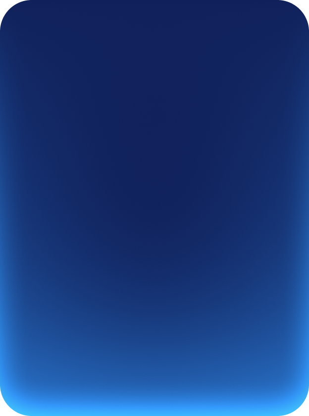

# Карточки «Мишки крутышки»

Единственная страница — **`cards.html`**: три типа карточек в двух размерах
на фоне из макета. Собрана по узлам `5830-498264` / `5830-498300` /
`5830-498331`.

## Типы и размеры

| тип        | lg            | sm          | подложка                          |
| ---------- | ------------- | ----------- | --------------------------------- |
| `Default`  | 312 × 420     | 240 × 320   | `card-lg.png` / `card-sm.png`     |
| `Апельсин` | 312 × 420     | 240 × 320   | `apelsin-card-lg.png` / `-sm.png` |
| `Мишка`    | 244.8 × авто  | 180 × авто  | градиент, без картинки            |

Общее для lg: отступы и радиус 32, размытие 20px. Для sm — 24 и 15px.

Различия между типами:

- **Default** — `justify-content: space-between`: номер с иконкой сверху,
  заголовок снизу. Номер 56/48px, иконка 48/40px, шеврон 28/24px.
- **Апельсин** — вместо `space-between` используется `gap`, а блок логотипа
  растянут через `flex: 1 0 0` и центрирует логотип в свободном месте.
  Логотип 218 × 105.7 (lg) и 140 × 67.9 (sm).
- **Мишка** — единственный тип **без фоновой картинки**: подложка это
  `linear-gradient(180deg, rgba(138,157,214,0.10), #DFAABF)` плюс
  `backdrop-filter`. Высота не задана — собирается по контенту. Есть
  отдельный слой внутренних бликов
  (`inset 0 1px 2px rgba(255,255,255,.5)` и `inset 0 -32px 56px -24px #fff`).

Про арт мишки: слот 212 × 212 (lg) и 156 × 156 (sm), а само изображение
крупнее — 291 и 214 соответственно. Это не ошибка: арт намеренно выходит
за слот и обрезается краями карточки, так задано в макете.

Ширина `244.8px` у большой карточки мишки — тоже из макета, не опечатка.
Дробная ширина слегка мылит границу на 1x-экранах; если это мешает,
округлите до `245px`.

## Раскладка

Повторяет фреймы напрямую: один ряд с `flex-wrap` и зазором 24px, ширина
ряда 1176px по центру. Это ровно те цифры, что стоят в макете — на 1280
помещаются все четыре карточки с изображением, мишки переносятся во второй
ряд; на 768 получается два столбца, на 360 — один. Отдельные медиазапросы
не нужны, перенос делает всё сам.

## Фон

`img/mishki-bg.png` из макета, положен как в макете: от левого верхнего угла,
`fixed`, с явным `background-size`. `repeat` — на случай экрана шире тайла;
подложка бесшовная (проверено: расхождение противоположных краёв 2.5 из 255
против 5.8 у двух случайных столбцов).

**Размер фона зависит от брейкпоинта** — так задано в макете:

| брейкпоинт            | ширина      | background-size |
| --------------------- | ----------- | --------------- |
| mobile (`5830-498331`)| ≤ 767px     | `960px`         |
| tablet (`5830-498300`)| 768–1279px  | `1920px`        |
| desktop(`5830-498264`)| ≥ 1280px    | `1920px`        |

На мобильном фон вдвое мельче, поэтому звёзды не выглядят непропорционально
крупными на узком экране. Реализовано переменной `--bg-size` (по умолчанию
`1920px`), которую media-query `max-width: 767px` переопределяет на `960px`.
Граница проверена пиксельно: 767px даёт 960px, 768px — 1920px.

Переменную используют два места сразу — `body` и `.card__blur` (размытая
копия фона обязана совпадать с фоном страницы), поэтому размер и вынесен
в одну переменную.

Размер фона важен не только сам по себе. Карточки смешиваются с фоном через
`mix-blend-mode: lighten`, то есть берут его яркость. Если задать фону
`cover`, на высоком вьюпорте картинка увеличивается в разы, светлеет — и
карточки выцветают следом. Поэтому размер задан явными числами.

Файл фона: в макете это PNG 3840 × 3840 (~19 МБ). В репозитории лежит версия
2048 × 2048 (~4 МБ) из присланного архива — тот же рисунок в меньшем
разрешении. При `background-size: 1920px` это почти 1:1; на 2× экранах фон
чуть мягче, зато вес в разы меньше. Если нужна максимальная чёткость —
замените файл на 3840-версию из макета.

## Устройство карточки с изображением

```html
<div class="card card--lg card--default">
  <div class="card__inner">
    <div class="card__bg" aria-hidden="true">
      <div class="card__blur"></div>
      <div class="card__tint"></div>
      
    </div>
    …контент…
  </div>
</div>
```

Снизу вверх: размытая копия фона, тонирующая заливка
`rgba(138,157,214,0.10)`, картинка с `object-fit: cover` и
`mix-blend-mode: lighten`. Контент обязан быть `position: relative`, иначе
абсолютный слой `.card__bg` перекроет его.

### Почему mix-blend-mode, а не background-blend-mode

Главный подвох при переносе из Figma. Там режим наложения слоя смешивает
его с тем, что лежит **под ним на холсте**, то есть с фоном страницы.
В CSS такому поведению соответствует `mix-blend-mode`.

`background-blend-mode` — другое свойство: оно смешивает фоновые слои
**внутри одного элемента** и до фона страницы не дотягивается. С ним
карточка получается полностью глухой и расходится с макетом.

Панель «Copy as CSS» в Figma выдаёт именно неправильный вариант — она
схлопывает два отдельных слоя в одну строку `background` и подменяет
`mix-blend-mode` на `background-blend-mode`. Правильную структуру отдаёт
codegen (Figma MCP, `get_design_context`) — там честно стоит
`mix-blend-lighten` на теге ``.

Там же ломается и сама строка `background`:

```css
background: url(<path>) lightgray 50% / cover no-repeat, rgba(138,157,214,0.10);
```

В шорткате `background` цвет допустим только в последнем слое. Figma кладёт
`lightgray` (свой плейсхолдер под изображение) в первый, поэтому всё
объявление отбрасывается как невалидное: computed-значения выходят
`background-image: none` и `background-color: rgba(0,0,0,0)` — карточка
не отрисовывается вообще.

### Почему размытие сделано копией фона, а не backdrop-filter

Размытие даёт отдельный слой `.card__blur` — копия фона страницы с
`filter: blur()`. Это выглядит избыточно, но `backdrop-filter` не годится
ни в одном из двух вариантов:

- **на том же элементе, где `mix-blend-mode`** — работает только в Chromium.
  Safari и Firefox молча выбрасывают размытие, и фон просвечивает резким;
- **на родительском слое** — родитель становится изолированной группой,
  `mix-blend-mode` внутри перестаёт видеть фон страницы, и карточка
  становится полностью глухой. Проверено: разница между «блюр вкл» и
  «блюр выкл» падает с 80% пикселей до 0.1%.

Копия фона свободна от обоих ограничений. Слой повторяет `background`
страницы объявление в объявление, включая `attachment`, поэтому совмещается
с ним при любом поведении браузера. `filter` размывает и края слоя, поэтому
слой больше карточки на `3 × blur`, а лишнее срезает `overflow` родителя.

Плата — слой знает про фон страницы. Если положить карточку на другой фон,
`.card__blur` нужно поправить вместе с ним. У карточек мишек этой проблемы
нет: там `backdrop-filter` стоит на слое без `mix-blend-mode` и работает
везде.

### Светлота карточки зависит от фона

`lighten` берёт поканальный максимум, поэтому чем светлее фон под карточкой,
тем светлее сама карточка. Это не баг, а суть режима — в макете карточки
над яркими участками фона тоже выглядят светлее. Если карточка кажется
выцветшей, дело в яркости фона, а не в CSS.

## Шрифт

Макет использует X5 Sans. Он не поставляется с репозиторием, поэтому стоит
первым в `font-family`, а дальше идёт системный фолбэк. Кегли, интерлиньяж
и трекинг заданы по макету.

## Ассеты

| файл                                | что это                                  |
| ----------------------------------- | ---------------------------------------- |
| `img/mishki-bg.png`                 | фон страницы, 2048 × 2048, бесшовный      |
| `img/card-lg.png`, `-sm.png`        | подложки типа Default                     |
| `img/apelsin-card-lg.png`, `-sm.png`| подложки типа Апельсин                    |
| `img/apelsin-lg.svg`, `-sm.svg`     | логотип Апельсин                          |
| `img/chevron-28.svg`, `-24.svg`     | шеврон в иконке                           |
| `img/mixy.png`                      | арт мишки, 1000 × 1000                    |
| `img/mixy-small.png`                | тот же арт из архива, 245 × 284 — не используется: слишком мал для слота 212px на 2x |

Подложки и фон — из присланного архива. SVG выгружены из Figma: в архиве
их не было.
